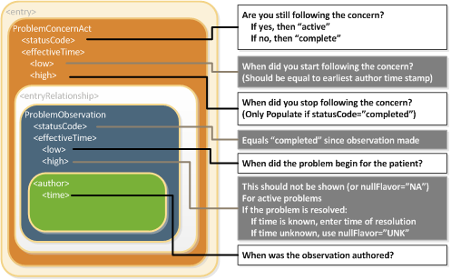

Design considerations describe overarching principles that have been developed and applied across the CDA templates in this guide. Material in this section can be thought of as “heuristics,” as opposed to the formal, testable constraints found in Volume 2 of this guide.

### Compatibility

This release contains new versions of templates included in C-CDA Release 2.0. Templates in this specification provide compatibility for software that supports template versions in the C-CDA R1.1 Implementation Guide. The new compatible template versions contain constraint modifications which enable compatibility with C-CDA 1.1. The constraints updated for C-CDA R2.1 are identified in the appendix Volume 2 Summary of Changes.

C-CDA Release 2.0 includes several templates not previously present in C-CDA Release 1.1. Software designed to support C-CDA Release 1.1 template versions may not support the new templates introduced in C-CDA Release 2.0. Except where explicitly prohibited by the C-CDA 1.1 specification, use of templates first released as part of C-CDA Release 2.0 is permitted.

New systems that wish to support C-CDA R1.1, R2.0, and R2.1, should review all specifications. A system developed strictly to the R2.1 version might not automatically support receiving R1.1 documents without additional development. Support for R2.0 conformant documents will require additional generation and import effort since different vocabulary requirements apply in several places.

Compatibility Principles

The baseline for C-CDA Release 2.1 is C-CDA Release 2.0. HL7 has applied these principles against templates present in C-CDA Release 1.1 and C-CDA R2.0 to create compatible template versions:

1. When a SHALL constraint present in C-CDA R1.1 is relaxed to SHOULD or MAY in C-CDA R2.0, the C-CDA R2.1 specification will increase the strength of that constraint to SHALL when compatibility is asserted.
2. When a SHALL constraint present is C-CDA R1.1 is removed in C-CDA R2.0, the C-CDA R2.1 specification will add that constraint when supporting compatibility.
3. When a SHOULD or MAY constraint present in C-CDA R1.1 is relaxed or removed in C-CDA R2.0, the C-CDA R2.1 specification will remain silent. As these constraints are not strictly required in a C-CDA R1.1 instance, they are not necessary for backwards compatibility. Implementers who wish to continue to convey data elements with a SHOULD or MAY constraint in C-CDA R1.1 can still report this information as it was done in C-CDA R1.1, so long as these are also conformant with this specification.
4. A SHALL, SHOULD or MAY constraint added in C-CDA R2.0 that is not explicitly prohibited in C-CDA R1.1 will be added to C-CDA R2.1.
5. When a vocabulary or value set binding has changed for an element to a new coding system in C-CDA R2.0, C-CDA R2.1 will — when supporting backwards compatibility — require the use of the old value set or vocabulary in element/code, the new value set or vocabulary in element/translation, and otherwise require the use of the new value set or vocabulary in code as it was constrained (with the same strength appearing) in C-CDA R2.0.

#### Support for specifications with dependencies on C-CDA Release 2.0

There are two options for other specifications that have built upon C-CDA Release 2.0:

1. Reference the C-CDA R2.1 implementation guide and the template versions defined herein, in order to ensure backward compatibility for software compliant with C-CDA R1.1.
2. Reference the C-CDA R2.0 implementation guide and the templates contained therein to support software that does not require backward compatibility. Software designed to receive documents conformant to C-CDA R2.0 or C-CDA R2.1 template versions will need to support vocabulary bindings that allow value set concepts to appear in either the code or the translation element.

The SDWG strongly encourages specifications built on C-CDA R2.0 to adopt option 1 since option 2 increases variability across implementations. After final publication of R2.1 SDWG will contact developers of prior specifications, which reference C-CDA R2.0, to discuss migration plans.

#### Assertion of Compatibility

Volume 2 of this guide includes a requirement that all C-CDA R2.1 conformant instances:

* Include a C-CDA R2.1 templateId,
* Additionally, when the C-CDA R2.1 templateId includes an extension, the C-CDA R1.1 templateId must also be included.

By including both templateIds the sending application is asserting conformance with C-CDA R2.1 and C-CDA R1.1. This requirement (CONF:32936) is included in the US Realm Header (V3):

  *SHALL* contain exactly one [1..1] templateId (CONF:1198-5252) such that it
  a. *SHALL* contain exactly one [1..1] *@root*="2.16.840.1.113883.10.20.22.1.1" (CONF:1198-10036).
  b. *SHALL* contain exactly one [1..1] *@extension*="2015-08-01" (CONF:1198-32503).
  c. When asserting this templateId, all document, section, and entry templates *SHALL* include a templateId root without an extension. See C-CDA R2.1 Volume 1 - Design Considerations for additional detail (CONF:1198-32936).
  
**C-CDA R2.1 Discharge Summary header example**

```
<ClinicalDocument xmlns="urn:hl7-org:v3" xmlns:xsi="http://www.w3.org/2001/XMLSchema-instance" xmlns:cda="urn:hl7-org:v3" xmlns:sdtc="urn:hl7-org:sdtc">
	<!-- ** CDA Header ** -->
	<realmCode code="US"/>
	<typeId root="2.16.840.1.113883.1.3" extension="POCD_HD000040"/>
	<!-- US General Header Template -->
	<templateId root="2.16.840.1.113883.10.20.22.1.1" extension="2015-08-01"/>
	<!--Critical Change for backwards compatibility-->
	<templateId root="2.16.840.1.113883.10.20.22.1.1"/>
	<!-- *** Note: The next templateId, code and title will differ depending on what type of document is being sent. *** -->
	<templateId root="2.16.840.1.113883.10.20.22.1.8" extension="2015-08-01"/>
	<!--For backwards compatibility-->
	<templateId root="2.16.840.1.113883.10.20.22.1.8"/>
...
```

**C-CDA R2.1 Problem List Section example**

```
<section>
	<templateId root="2.16.840.1.113883.10.20.22.2.5.1" extension="2014-06-09"/>
	<!--For backwards compatibility-->
	<templateId root="2.16.840.1.113883.10.20.22.2.5.1"/>
	<code code="11450-4" codeSystem="2.16.840.1.113883.6.1" displayName="Problem List"/>
	<title>Problem List</title>
...
```

**C-CDA R2.1 Problem Concern Entry example**

```
<entry>
	<act classCode="ACT" moodCode="EVN">
	<templateId root="2.16.840.1.113883.10.20.22.4.3" extension="2014-06-09"/>
	<!--For backwards compatibility-->
	<templateId root="2.16.840.1.113883.10.20.22.4.3"/>
	<id root="102ca2e9-884c-4523-a2b4-1b6c3469c397"/>
	<code code="CONC" codeSystem="2.16.840.1.113883.5.6"/>
...
```

### CDA Participations

A CDA participant (e.g., Author, Informant), per the Reference Information Model (RIM), is “an association between an Act and a Role with an Entity playing that Role. Each Entity (in a Role) involved in an Act in a certain way is linked to the Act by one Participation-instance. The kind of involvement in the Act is specified by the Participation.typeCode.”

CDA principles when asserting participations include:

* Participation persistence: An object's participations (and participation time stamps) don't change just because that object is reused. For instance, authorship of an object doesn't change just because that object is now included in a summary document.
* Participation evolution: Additional participations (and participation time stamps) can be ascribed to an object over its lifetime. (In some cases, an electronic health record (EHR) system will create a new object instead of adding participants to an existing object, such as when an EHR has imported a CCD and the receiving clinician chooses to create a local problem list entry corresponding to a problem in the CCD).
* Device participation: Devices do not participate as legally responsible entities, but can participate as authors in some scenarios.

Meaningful Use Stage 29 criterion §170.314(b)(4) Clinical Information Reconciliation requires a system to “simultaneously display (i.e., in a single view) the data from at least two list sources in a manner that allows a user to view the data and their attributes, which must include, at a minimum, the source and last modification date.”

CDA addresses this requirement via the Author Participation and its time stamp. CDA requires that Author and Author time stamp be asserted in the document header. From there, authorship propagates to contained sections and contained entries, unless explicitly overridden. Thus, all entries in CDA implicitly include Author and Author time stamp.

In this version of CDA, we have added a new Author Participation template (templateId 2.16.840.1.113883.10.20.22.4.119) to better ensure consistent representation. This template should be used to explicitly assert authorship and author time stamps, unless the values propagated from the document header hold true.

### Determining the Status of Clinical Statement

A recipient must be able to determine whether the status of an entry — which can include a problem, a medication administration, etc. — is active, completed, or in some other state. Determination of the exact status is dependent on the interplay between an act’s various components (such as statusCode and effectiveTime), and inconsistent modeling between different objects.

The following principles apply when representing or interpreting a clinical statement’s status.

* The Act.statusCode of the clinical statement specifies the state of the entry: Per the RIM, the statusCode “reflects the state of the activity. In the case of an Observation, this is the status of the activity of observing, not the status of what is being observed.”
* Act.statusCode and Act.moodCode are inter-related: Generally, an act in EVN (event) mood is a discrete event (a user looks, listens, measures; records what was done or observed), so generally an act in EVN mood will have a statusCode of “completed.” A prolonged period of observation is an exception, in which a user would potentially have an observation in EVN mood that is “active.” For an Observation in RQO (request) mood, the statusCode generally remains “active” until the request is complete, at which time the statusCode changes to “completed.” For an Observation in GOL (goal) mood, the statusCode generally remains “active” as long as the observation in question is still an active goal for the patient.
* Act.statusCode and Act.effectiveTime are inter-related: Per the RIM, the effectiveTime, also referred to as the “biologically relevant time,” is the time at which the act holds for the patient. So, whereas the effectiveTime is the biologically relevant time, the statusCode is the state of the activity. For a provider seeing a patient in a clinic and observing a history of heart attack that occurred 5 years ago, the status of the observation is completed, and the effectiveTime is five years ago.

The Problem Concern Act (V2) (templateId 2.16.840.1.113883.10.20.22.4.3:2014-06-09) reflects an ongoing concern on behalf of the provider who placed the concern on a patient’s problem list. So long as the provider has an ongoing concern — meaning that the provider is monitoring the condition, whether it includes problems that have resolved or not — the statusCode of the Problem Concern Act is “active.” When the underlying condition is no longer an active concern, the statusCode of the Problem Concern Act is set to “completed.” The effectiveTime of a Problem Concern Act reflects the time that the concern about an underlying condition — as such, the effectiveTime of the concern may not correspond to the effectiveTime of the condition. For example, a patient may have suffered a heart attack 5 years ago, but a physician may continue to have an active concern about the patient’s cardiac condition.

A Problem Concern Act can contain one or more Problem Observations (templateId 2.16.840.1.113883.10.20.22.4.4:2014-06-09). Each Problem Observation is a discrete observation of a condition and therefore has a statusCode of “completed.” The statusCode of the Problem Concern Act is the definitive indication of the status of the concern. The effectiveTime of the Problem Observation is the definitive indication of whether the underlying condition is resolved. This is shown graphically in the following figure.



C-CDA 1.1 included several optional “status” observation templates such as Problem Status Observation and Allergy Status Observation. These “status” observation templates were deprecated when C-CDA R2.0 was released. (For more about deprecated templates, see the section titled Use of Deprecated Template Versions). In C-CDA R2.1, the “status” observation templates remain deprecated. To support backward compatibility, systems that consume CDA documents need to address the possibility that a “status” observation template may also be present. The following guidance should be followed if a CDA document includes a deprecated status observation:

| Deprecated “status” observation template | Implementer Guidance |
| ---------------------------------------- | -------------------- |
| A status of “active” | If the parent Observation has an effectiveTime/high, the content contains conflicting information. |
| A status of “resolved” | If the parent Observation does not have an effectiveTime/high, the content contains conflicting information. |
| A status of “inactive” | If the parent Observation does not have an effectiveTime/high, the content has the potential to contain conflicting information. |

### Rendering Header Information for Human Presentation

Metadata carried in the header may already be available for rendering from EHRs or other sources external to the document. An example of this would be a doctor using an EHR that already contains the patient’s name, date of birth, current address, and phone number. When a CDA document is rendered within that EHR, those pieces of information may not need to be displayed since they are already known and displayed within the EHR’s user interface.

Good practice recommends that the following be present whenever the document is viewed:

* Document title and document dates
* Service and encounter types, and date ranges as appropriate
* Names of all persons along with their roles, participations, participation date ranges, identifiers, address, and telecommunications information
* Names of selected organizations along with their roles, participations, participation date ranges, identifiers, address, and telecommunications information
* Date of birth for recordTarget(s)
* Patient identifying information

In Operative and Procedure Notes, the following information is typically displayed in the EHR and/or rendered directly in the document:

* The performers of the surgery or procedure, including any assistants
* The surgery or procedure performed (serviceEvent)
* The date of the surgery or procedure

### Narrative Reference

The C-CDA R1.1 release recommended that clinical statements include a link between the narrative (section.text) and coded clinical data (entry). Rather than repeat these constraints in every applicable entry, SDWG agreed in R2.0 to apply the following constraint to all entry templates, unless explicitly prohibited.

  *SHOULD* contain zero or one [0..1] text (CONF:XXXX).
    a. The text, if present, *SHOULD* contain zero or one [0..1] reference/@value (CONF: XXXX).
      i. This reference/@value *SHALL* begin with a '#' and *SHALL* point to its corresponding narrative (using the approach defined in CDA R2.0, section 4.3.5.1) (CONF: XXXX).
  *MAY* contain zero or one [0..1] originalText (CONF:XXXX).
    a. The originalText, if present, *SHOULD* contain zero or one [0..1] reference/@value (CONF:XXXX).
	  i. This reference/@value *SHALL* begin with a '#' and SHALL point to its corresponding narrative (using the approach defined in CDA R2.0, section 4.3.5.1) (CONF:XXXX).
	  
### Unknown and No Known Information

Information technology solutions store and manage data, but sometimes data are not available. An item may be unknown, not relevant, or not computable or measureable, such as where a patient arrives at an emergency department unconscious and with no identification.

In many cases, the C-CDA standard will stipulate that a piece of information is required (e.g., via a SHALL conformance verb). However, in most of these cases, the standard provides an “out”, allowing the sender to indicate that the information isn’t known.

Here, we provide guidance on representing unknown information. Further details can be found in the HL7 V3 Data Types Release 1 specification that accompanies the CDA R2 normative standard. However, it should be noted that the focus of Consolidated CDA is on the unambiguous representation of known data, and that in general, the often subtle nuances of unknown information representation are less relevant to the recipient.

Many fields in C-CDA contain a “@nullFlavor” attribute, used to indicate an exceptional value. Some flavors of Null are used to indicate that the known information falls outside of value set binding constraints. Not all uses of the @nullFlavor attribute are associated with a case in which information is unknown. Allowable values for populating the attribute give details about the reason the information is unknown, as shown in the following example.

**nullFlavor Example**

```
<birthTime nullFlavor=”UNK”/> <!--Sender does not know the birthTime, but a proper value is applicable -->
```

Use null flavors for unknown, required, or optional attributes:

| NI | No information. This is the most general and default null flavor. |
| NA | Not applicable. Known to have no proper value (e.g., last menstrual period for a male). |
| UNK | Unknown. A proper value is applicable, but is not known. |
| ASKU | Asked, but not known. Information was sought, but not found (e.g., the patient was asked but did not know). |
| NAV | Temporarily unavailable. The information is not available, but is expected to be available later. |
| NASK | Not asked. The patient was not asked. |
| MSK | There is information on this item available but it has not been provided by the sender due to security, privacy, or other reasons. There may be an alternate mechanism for gaining access to this information. |
| OTH | The actual value is not an element in the value domain of a variable. (e.g., concept not provided by required code system). |

The list above contains those null flavors that are commonly used in clinical documents. For the full list and descriptions, see the nullFlavor vocabulary domain in the CDA R2 normative edition.10

Any SHALL, SHOULD or MAY conformance statement may use nullFlavor, unless the nullFlavor is explicitly disallowed (e.g., through another conformance statement which includes a SHALL conformance for a vocabulary binding to the @code attribute, or through an explicit SHALL NOT allow use of nullFlavor conformance).

**Attribute Required (nullFlavor not allowed)**

1. *SHALL* contain exactly one [1..1] code (CONF:15407).
  a. This code *SHALL* contain exactly one [1..1] @code="11450-4" Problem List (CodeSystem: LOINC 2.16.840.1.113883.6.1) (CONF:15408).
  or
2. *SHALL* contain exactly one [1..1] *effectiveTime/@value* (CONF:5256).

**Allowed nullFlavors When Element is Required (with xml examples)**

1. *SHALL* contain at least one [1..*] id
2. *SHALL* contain exactly one [1..1] code
3. *SHALL* contain exactly one [1..1] effectiveTime

```
<entry>
	<observation classCode="OBS" moodCode="EVN">
		<id nullFlavor="NI"/>
		<code nullFlavor="OTH">
			<originalText>New Grading system</originalText>
		</code>
		<statusCode code="completed"/>
		<effectiveTime nullFlavor="UNK"/>
		<value xsi:type="CD" nullFlavor="OTH">
			<originalText>Spiculated mass grade 5</originalText>
		</value>
	</observation>
</entry>
```

If a sender wants to state that a piece of information is unknown, the following principles apply:

1. If the sender doesn’t know an attribute of an act, that attribute can be null.

**Unknown Medication Example**

1. *SHALL* contain exactly one [1..1] code

```
<entry>
	<text>patient was given a medication but I do not know what it was</text>
	<substanceAdministration moodCode="EVN" classCode="SBADM">
		<consumable>
			<manufacturedProduct>
				<manufacturedLabeledDrug>
					<code nullFlavor="NI"/>
				</manufacturedLabeledDrug>
			</manufacturedProduct>
		</consumable>
	</substanceAdministration>
</entry>
```

2. If the sender doesn’t know if an act occurred, the nullFlavor is on the act (detail could include specific allergy, drug, etc.).

**Unknown Medication Use of Anticoagulant Drug Example**

```
<entry>
	<substanceAdministration moodCode="EVN" classCode="SBADM" nullFlavor="NI">
		<text>I do not know whether or not patient received an anticoagulant drug</text>
		<consumable>
			<manufacturedProduct>
				<manufacturedLabeledDrug>
					<code code="81839001" displayName="anticoagulant drug" codeSystem="2.16.840.1.113883.6.96" codeSystemName="SNOMED CT"/>
				</manufacturedLabeledDrug>
			</manufacturedProduct>
		</consumable>
	</substanceAdministration>
</entry>
```

3. If the sender wants to state "no known", a negationInd can be used on the corresponding act (substanceAdministration, Procedure, etc.) Previously, CCD, IHE, and HITSP recommended using specific codes to assert no known content, for example 160244002 No known allergies or 160245001 No current problems or disability. Specific codes are still allowed; however, use of these codes is not recommended. These next examples illustrate nuances of representing information in coded fields when information is a negative assertion, for example it is not the case that the patient has an allergy or it is not the case that a patient takes a medication. The phrases "no known allergies" or "no known medications" are typically associated with this type of negative assertion.

**No Known Medications Example**

```
<entry>
	<substanceAdministration moodCode="EVN" classCode="SBADM" negationInd=”true”>
		<text>No known medications</text>
		<consumable>
			<manufacturedProduct>
				<manufacturedLabeledDrug>
					<code code="410942007" displayName="drug or medication" codeSystem="2.16.840.1.113883.6.96" codeSystemName="SNOMED CT"/>
				</manufacturedLabeledDrug>
			</manufacturedProduct>
		</consumable>
	</substanceAdministration>
</entry>
```

**Value Known, Code for Value Not Known**

```
<entry>
	<observation classCode="OBS" moodCode="EVN">
		…
		<value xsi:type="CD" nullFlavor="OTH">
			<originalText>Spiculated mass grade 5</originalText>
		</value>
	</observation>
</entry>
```

**Value Completely Unknown**

```
<entry>
	<observation classCode="OBS" moodCode="EVN">
		…
		<value xsi:type="CD" nullFlavor="UNK"/>
	</observation>
</entry>
```

**Value Known, Code in Required Code System Not Known But Code from Another Code System is Known**

```
<entry>
	<observation classCode="OBS" moodCode="EVN">
		…
		<value xsi:type="CD" nullFlavor="OTH">
			<originalText>Spiculated mass grade 5</originalText>
			<translation code="129742005" displayName="spiculated lesion" codeSystem="2.16.840.1.113883.6.96" codeSystemName="SNOMED CT"/>
		</value>
	</observation>
</entry>
```